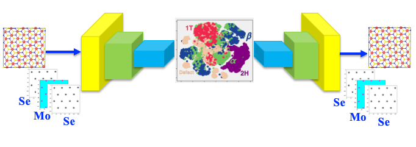

# Deep Generative Model of Phase Transformation in Layered Materials

[P. Rajak, *et al.*, *Phys. Rev. B 100*, 014108: 1-7 (2019)](https://journals.aps.org/prb/abstract/10.1103/PhysRevB.100.014108)



Optical and electrical properties of two-dimensional (2D) layered materials can be tuned by mechanical straining, which induces transformations from semiconducting to metallic phases. Here, we have developed a generative model of the phase transformation pathways in MoWSe<sub>2</sub> hetero-structure during  dyanamic fracture using variational autoencoder (VAE). The training dataset for VAE is generated using molecular dynamics (MD) simulation for different system sizes and strain rate. After training, VAE correctly identifies transformation pathways connecting the semiconducting (2H) and metallic (1T) phases via novel intermediate structures called _&alpha;_ and _&beta;_, which is also observed experimently.  Further, the stability of the structures synthesized from VAE are validated by quantum simulations based on density functional theory.</br>
This repository includes (1) C code to construct training dataset for VAE and Conditional VAE (CVAE) in numpy format from the MD simulaition trajectories of MoWSe<sub>2</sub>  fracture, (2) A sample fracture frame form MD simulation and (3) Ipython notebook for the training and anlysis of the VAE and CVAE models. </br>

## 1. Requirements
   - gcc
   - python3.6
   - tensorflow 1.9.0
   - matplotlib
   - sklearn
   - numpy
   - Ovito 3.2.0
## 2. Dataset Generation 
Training dataset generation involves construction of random tensors of size 64&times;64&times;3 from the MD fracture simulation trajectory of MoWSe<sub>2</sub>. To do that run the script construct_data.sh</br>
        ```sh construct_data.sh```
* ```construct_data.sh does the following in sequence```
   * Find 2H and 1T  structure inside the fracture data. The code for this inside the folder  ``find_structure``. Its input is a MD fracture frame in xyz file format, and it writes a file called *structure.xyz*, where atoms are labeled as 2H, 1T or defects. </br>
   ```A sample input frame from the fracture simulation called fracture.xyz is provided.```
   * Find defect ring structure insde the 1T phase of the fracture data. The code for this inside the folder ``find_ring``. The input to the code is generated *structure.xyz* from the previous step, and it writes output file called *structure_ring.xyz* containing the information about defect ring structure in the 1T phase
   * Find interfact between 2H and 1T regions inside the fracture data. The code for this inside the folder ``find_interface``. It takes *structure_ring.xyz* as input and writes the output file *interface.xyz* 
   * Find alpha and beta structures at the interface region. The code for this inside the folder ``find_interface_structure``. It takes *interface.xyz* as inout and  writes an output file called train.xyz, where each atom is labeled as 2H, 1T, defect, alpha and beta. </br>
   ``` The generated  *train.xyz* file can be visulized in ovito, where atoms belonging to different category can be colored by last column of the xyz file.```
   * Construct  n&times;64&times;64&times;3 tensors using the processed fracture frame. The code for this inside the folder `construct_tensor`. It takes the frame train.xyz, and construct random patches of 64&times;64&times;3 tensors which contains patchs of 2H, 1T, defect,  _&alpha;_ and _&beta;_ phases. This section runs the following command 
           * ```./c_feature ../train.xyz $limit $tag``` </br>  *Here, train.xyz=Processed MD frame, $limit=max number of tensors to be generated and $tag=1,2,3,4,5 corrosponds to regions consisting of 2H, 1T, defects, interface defects, _&alpha;_ and _&beta;_ phases, respectively.* </br>
           * ```python3.6 create_tensor.py```
   * The generated dataset for VAE and CVAE training are written inside the folder ``data``, which are 
       * train_XX.npy : contains the N&times,64&times;64&times;3 numpy tensor 
       * train_YY.npy : corrosponding labels of the tensors  present in train_XX.npy
       * train_pos.npy : xyz atomic coordinate of the frames used to construct the train_XX.npy and train_YY.npy
   * ```Note: For full training of the VAE and CVAE model, multiple frames from fracture trajectories will be needed, which will be available from authors upon request.```

## 3. Traininig and Analysis
    3a. VAE_model_for2H-1T.ipynb : is a ipython notebook that trains the VAE model of phase transformation.
    3b. CVAE.ipynb : is a ipython notebook that trains the Conditional VAE model using the fracture data.

